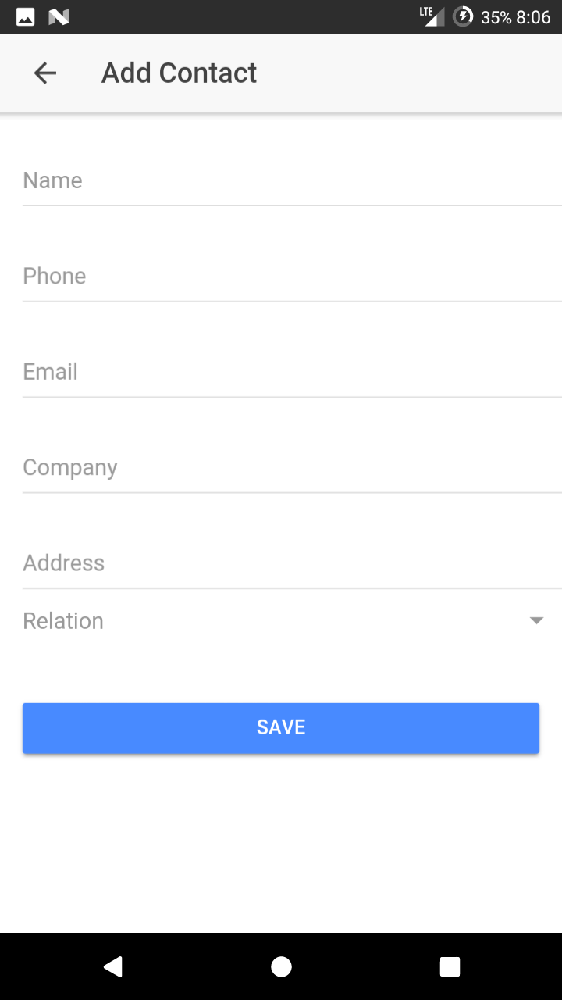
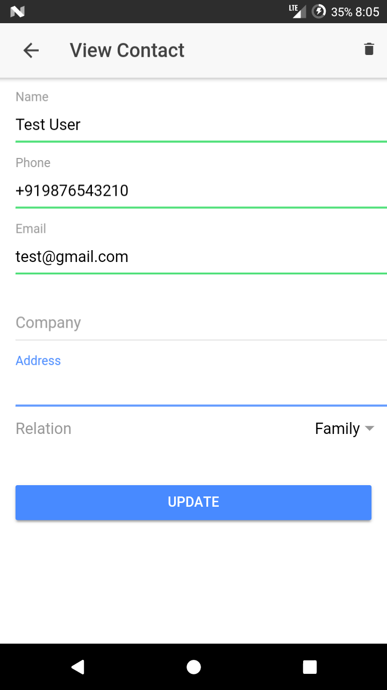
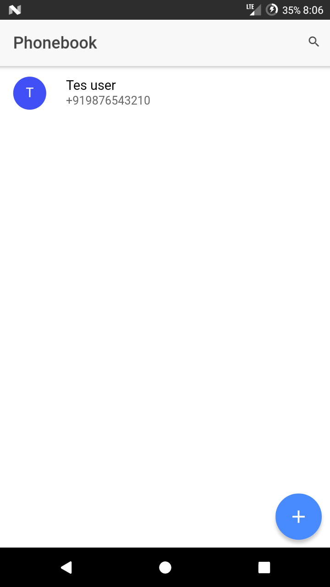

## Phonebook





## Dependencies

1. Node Js ~ >=v8
2. npm ~ >=v5
3. Ionic Framework `npm install -g ionic`
4. Cordova  `npm install -g cordova`

##  How to build

1. Run in browser
```bash
# Clone this repo
git clone https://github.com/rajmani1995/Phonebook.git
cd Phonebook
# Install npm dependencies
npm install
# Open app in browser
ionic serve
```
2. Run on android (Android SDK Must be installed)
```bash
# Enable Cordova
cordova telemetry on
# Set Android Home
export ANDROID_HOME=$HOME/Android/Sdk
export PATH=$ANDROID_HOME/tools:$ANDROID_HOME/platform-tools:$PATH
# Add platform
ionic cordova platform add android
# Build APK
ionic cordova build android
# find APK in platforms/android/app/build/outputs/apk/debug
```
>Install apk on android device with `adb`, install adb on ubuntu `apt install android-tools-adb`
enable `Developer Tools` in Android Device and install apk with command `adb install /path/to/apk`

### License

The MIT License